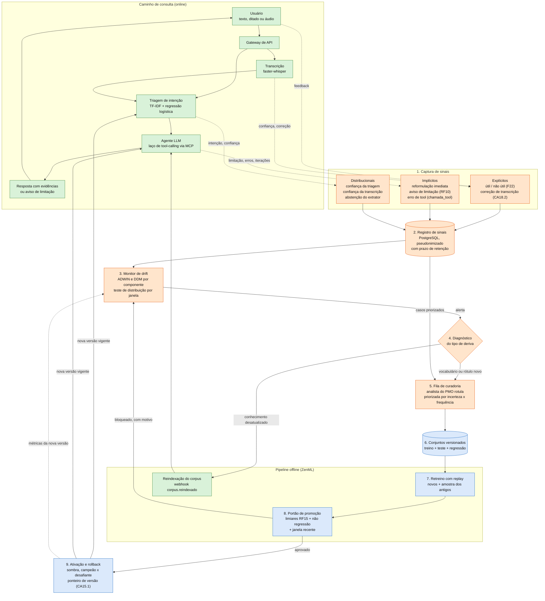

# Aprendizado contínuo no NexSta: uma proposta contra o *concept drift*

Autor: Lucas Brasil
Instituição: Inteli, Instituto de Tecnologia e Liderança
Sistema de referência: NexSta (Next Station), agente conversacional de consulta ao portfólio de projetos do PMO Corporativo do Metrô de São Paulo, desenvolvido pelo Grupo 3 (T17, 2026-2A)
Alternativa escolhida: 1, aprendizado contínuo

---

## Sumário

1. [Introdução](#1-introdução)
2. [Solução proposta](#2-solução-proposta)
3. [Conclusão](#3-conclusão)
4. [Referências bibliográficas](#referências-bibliográficas)

---

## 1. Introdução

### 1.1 O sistema conversacional

O NexSta é o agente conversacional que meu grupo construiu no módulo para o PMO Corporativo do Metrô de São Paulo. O usuário pergunta sobre o portfólio de projetos, digitando ou falando. Uma triagem decide se a pergunta é mesmo uma consulta ao portfólio. Se for, um modelo de linguagem busca na base de conhecimento pelas ferramentas somente leitura de um servidor MCP e responde citando o trecho de documento que usou. A base é montada por uma pipeline offline que classifica os documentos e reconhece entidades com um modelo treinado pela equipe.

Quatro partes do sistema aprenderam com dados e ficam congeladas depois do treino:

| Componente | Técnica | Onde é treinado | Quando é atualizado hoje |
|---|---|---|---|
| Triagem de intenção | TF-IDF de n-gramas de caracteres e regressão logística | Na subida do `worker-mcp`, a partir de `infra/triagem/dados/treino.csv` | Só quando alguém edita o CSV à mão |
| Classificação de documento e reconhecimento de entidades | BERTimbau multitarefa | Pipeline offline (ZenML), sobre corpus sintético | Só quando a pipeline é reexecutada manualmente |
| Transcrição de fala | `faster-whisper`, modelo local | Pré-treinado, sem ajuste | Nunca |
| Redação da resposta | LLM externo via OpenRouter ou Gemini | Pelo fornecedor | Nunca, do nosso lado. O conhecimento novo chega pela base de documentos |

### 1.2 O problema da falta de atualização

Um modelo supervisionado parte do princípio de que os dados que vai encontrar em uso seguem a mesma distribuição dos dados de treino. Quando isso deixa de ser verdade, ele continua respondendo com a mesma confiança e errando cada vez mais. A literatura chama esse fenômeno de *concept drift*, ou deriva de conceito.

Há deriva entre os instantes *t₀* e *t₁* quando muda a distribuição conjunta das entradas *X* e dos rótulos *y*, isto é, quando *Pt₀(X, y) ≠ Pt₁(X, y)* (GAMA et al., 2014; LU et al., 2019). Costuma-se separar dois casos. Na deriva real muda *P(y | X)*, e a mesma entrada passa a ter outro rótulo correto; nenhuma quantidade de dados antigos ensina a resposta nova. Na deriva virtual, ou *covariate shift*, muda só *P(X)*: as entradas chegam de regiões que o treino quase não cobriu, e o modelo extrapola mal. Gama et al. (2014) também classificam a mudança pelo jeito como ela se dá no tempo, que pode ser súbito, gradual, incremental ou recorrente. Bem antes, Widmer e Kubat (1996) já atribuíam o problema a contextos ocultos, variáveis que o modelo não enxerga mas que determinam a resposta certa.

Em modelos de linguagem o efeito foi medido. Lazaridou et al. (2021) avaliaram modelos em textos posteriores ao período de treino e o desempenho caiu, tanto mais quanto maior a distância no tempo. Retreinar também tem um custo escondido, porque uma rede ajustada só com dados novos tende a esquecer o que sabia antes, o chamado esquecimento catastrófico (McCLOSKEY; COHEN, 1989; KIRKPATRICK et al., 2017). O aprendizado contínuo estuda como incorporar o conceito novo preservando o antigo (PARISI et al., 2019; DE LANGE et al., 2022).

### 1.3 Por que o NexSta está exposto

No NexSta a deriva deve começar no primeiro dia de uso real. Encontro quatro motivos na documentação do próprio projeto (GRUPO 3, 2026).

O primeiro é o corpus de treino. Por exigência de *compliance* do TAPI, o MVP só usa dados sintéticos ou anonimizados, e a matriz de risco do projeto dá impacto máximo à chance de esses dados não representarem o portfólio real (risco R05). Quando entrarem documentos reais, com o vocabulário e os erros de preenchimento de verdade, haverá uma deriva virtual súbita.

O segundo é que o portfólio muda. Projetos entram e saem, o PMO revisa modelos de documento, e a ontologia tem versão própria (`versao_ontologia`). Um tipo de documento novo é deriva real, já que o rótulo correto de um mesmo trecho passa a ser outro. Nomes de projetos, linhas e estações aparecem aos poucos e afetam tanto o reconhecimento de entidades quanto a transcrição.

O terceiro é o jeito de perguntar. A triagem aprendeu com perguntas que nós mesmos escrevemos, e as quatro personas do projeto vão perguntar de formas que não previmos. Imagino que com picos ligados ao calendário de reporte do PMO, mas isso eu só conseguiria confirmar com dados reais.

O quarto é o mais sério: o sistema não percebe quando erra. O requisito RQ01.2 manda ampliar os conjuntos de avaliação "a cada erro observado em uso", e hoje nenhum erro em uso fica registrado. A decisão e a confiança da triagem vão apenas para o `logging.info` do `worker-mcp`, e a própria equipe, ao criar a tabela `chamada_tool`, escreveu que "log roda, some e não se consulta com SQL". O feedback do usuário sobre a resposta (feature F22) foi priorizado como "Futuro". O portão de promoção da pipeline (RF15) compara o modelo com limiares fixos sobre um conjunto de teste estático, então mede o desempenho nos dados de ontem. E a ativação de uma versão promovida (CA15.1, issue #368) ainda não foi implementada, de modo que nem um modelo melhor chegaria às consultas.

Sculley et al. (2015) incluem esse quadro entre as dívidas técnicas típicas de sistemas de aprendizado de máquina: sem medição depois da implantação, o modelo piora e ninguém nota. Num agente que apoia decisões do PMO e da diretoria, isso me preocupa mais do que uma falha visível, porque a resposta errada continua com cara de confiável.

### 1.4 Objetivo

Este documento propõe uma arquitetura para manter o NexSta atualizado. Ela detecta a deriva a partir do uso real, transforma erros observados em dados rotulados e promove versões novas dos modelos sem esquecimento catastrófico, respeitando as restrições de confidencialidade do Metrô.

---

## 2. Solução proposta

### 2.1 Princípio

Um sistema conversacional pode aprender com o uso de duas maneiras. Pode se alimentar das próprias conversas, como o *self-feeding chatbot* de Hancock et al. (2019), que transforma interações em exemplos de treino e pede feedback quando estima ter errado. Ou pode usar as conversas como fonte de sinais para um ciclo de melhoria supervisionado por pessoas.

Para o NexSta escolhi a segunda. O agente apoia decisões sobre projetos públicos, e o Tay, chatbot da Microsoft que aprendia com usuários sem curadoria e foi tirado do ar em menos de um dia, mostra bem o que acontece sem filtro (NEFF; NAGY, 2016). Pesou também o que já existe: o projeto tem uma pipeline offline que treina, compara três estratégias de extração e só promove o que passa nos limiares. A proposta usa essa mesma pipeline e entrega a ela dados do uso real e um critério para decidir quando rodar.

Liu e Mazumder (2021) defendem que chatbots aprendam durante a conversa, acumulando conhecimento e expressões novas a cada interação. Sigo essa ideia, com uma diferença: aqui a incorporação acontece em lotes auditáveis, e um analista do PMO revisa o que entra.

### 2.2 Diagrama de blocos da arquitetura

Verde é o que já existe no repositório, azul é o que existe em parte e será estendido, laranja é novo.

Se o visualizador não renderizar o diagrama, a mesma figura está em [`diagrama-arquitetura.png`](diagrama-arquitetura.png).

Na prática, cada consulta deixa sinais e o monitor procura mudança neles. Quando encontra, o caso vai para reindexação ou para curadoria. O que a curadoria rotula alimenta o retreino, e o candidato só substitui o modelo vigente se passar no portão. Depois de ativado, ele volta a ser monitorado.

### 2.3 Responsabilidades de cada módulo

#### Bloco 1: captura de sinais (novo)

Este bloco transforma cada interação em evidência sobre a qualidade dos modelos, sem mexer no caminho da consulta. Ele instrumenta pontos em que a informação já existe e hoje é descartada.

| Tipo | Sinal | Componente avaliado | Origem no código |
|---|---|---|---|
| Explícito | Botão útil / não útil ao fim de cada resposta | Agente LLM e recuperação | Feature F22, hoje no backlog |
| Explícito | Texto corrigido pelo usuário em transcrição de baixa confiança | Transcrição | CA18.2 já exige registrar a correção |
| Implícito | Pergunta reformulada logo após uma orientação da triagem | Triagem | Novo: comparar com a pergunta anterior da mesma sessão |
| Implícito | Aviso de limitação acionado | Recuperação e base de conhecimento | RF10; a RN10.1 já exige marcar a resposta |
| Implícito | Tool com erro, ou teto de iterações atingido | Agente LLM | Tabela `chamada_tool` (#473) |
| Distribucional | Intenção prevista e confiança da triagem | Triagem | Hoje só em `logging.info`, em `infra/mcp_cliente/consumidor.py` |
| Distribucional | Confiança média da transcrição | Transcrição | Coluna `transcricao.confianca` |
| Distribucional | Abstenções e discordância entre as estratégias de extração | BERTimbau | `Metricas.abstencoes` em `src/pipeline/avaliacao.py` |

O sinal de que mais gosto é a discordância entre estratégias, porque sai quase de graça. A pipeline já roda o modelo treinado, o baseline por regras e o extrator por LLM com o mesmo contrato. Se um documento novo chega e eles discordam sobre a classe, há um indício de deriva sem precisar de rótulo. As abstenções funcionam do mesmo jeito. O feedback explícito é o sinal mais confiável e também o mais raro, então o monitor não pode depender só dele.

Tenho uma dúvida sobre a reformulação. Quem reescreve a pergunta logo depois da orientação da triagem pode estar corrigindo um erro do classificador ou só lembrando de um detalhe que esqueceu. Não sei quanto ruído esse sinal carrega, e só dados reais vão responder. Até lá, ele entraria no monitor com peso menor que os outros.

#### Bloco 2: registro de sinais (novo)

Este bloco guarda os sinais num formato que dê para consultar e auditar sem ferir a confidencialidade do parceiro. A proposta é uma tabela `sinal_qualidade` no mesmo PostgreSQL, ligada à `consulta` pelo identificador de correlação que o sistema já propaga (CAN17.4). Cada linha tem o tipo de sinal, o componente, a versão do modelo vigente e o valor. Conteúdo de documento não entra, pela mesma regra que a equipe adotou na `chamada_tool`. O texto da pergunta só fica guardado quando o caso vai para curadoria, e mesmo assim pseudonimizado.

A versão do modelo em cada linha é o que permite comparar duas versões no mesmo período e saber qual mudança causou a melhora ou a piora.

Os sinais brutos expiram junto com as sessões (RN14.2), e só os exemplos aprovados na curadoria passam para os conjuntos versionados. Assim o sistema guarda dados para aprender sem contrariar a minimização pedida pelo RNF07: o que fica por tempo indefinido é pouco e foi revisado por alguém.

#### Bloco 3: monitor de drift (novo)

Este bloco decide, com teste estatístico, quando a qualidade de um componente mudou. Um *worker* periódico lê o registro e mantém dois tipos de detector por componente.

Para os sinais binários de erro (resposta marcada como não útil, reformulação, aviso de limitação), uso detectores sequenciais. O DDM (GAMA et al., 2004) acompanha a taxa de erro e define um nível de alerta e um de deriva. O ADWIN (BIFET; GAVALDÀ, 2007) mantém uma janela de tamanho variável e a corta quando as médias das duas partes ficam significativamente diferentes. Os dois estão no módulo `river.drift` da biblioteca `river` (MONTIEL et al., 2021).

Para as distribuições sem rótulo, como a confiança da triagem e da transcrição e a proporção de cada intenção, comparo a janela recente com a do treino pelo teste de Kolmogorov-Smirnov ou pelo índice de estabilidade populacional. Esse teste costuma acusar a deriva virtual antes de ela aparecer como erro.

No nível de alerta do DDM o monitor começa a separar casos para curadoria, e no nível de deriva aciona o diagnóstico. A taxa de aviso de limitação e a distribuição de intenções já estão previstas no painel do projeto (CAN17.5), então o monitor também ajuda a cumprir um requisito que já existe.

#### Bloco 4: diagnóstico do tipo de deriva (novo)

Este bloco escolhe a correção adequada, já que parte da deriva se resolve sem retreino. É aqui que a proposta se afasta de um retreino agendado toda semana. No NexSta vejo três situações:

| Situação | Exemplo | Ação |
|---|---|---|
| Conhecimento desatualizado | O cronograma de um projeto mudou e a resposta cita a versão anterior | Reindexar a base de documentos. Nenhum modelo é retreinado, e essa é a vantagem de usar recuperação em vez de conhecimento guardado nos parâmetros (LEWIS et al., 2020). A rota `corpus.reindexado` já existe |
| Deriva virtual (vocabulário novo) | Usuários passam a perguntar pela sigla de um programa novo e a triagem perde confiança | Curar exemplos e retreinar, sem mudar o catálogo de rótulos |
| Deriva real (rótulo novo) | O PMO cria um tipo de documento que não existe na ontologia | Decidir a modelagem: nova versão da ontologia, anotação de exemplos e retreino. O receptor do webhook já recusa reindexação com `versao_ontologia` divergente (CA15.4), o que impede misturar vocabulários |

O diagnóstico é semiautomático. O monitor sugere uma hipótese pelo padrão dos sinais: avisos de limitação concentrados num projeto apontam para conhecimento desatualizado, e queda de confiança da triagem sem aumento de limitação aponta para vocabulário novo. Quem opera o sistema decide.

#### Bloco 5: fila de curadoria (novo)

Este bloco transforma casos suspeitos em exemplos rotulados, gastando o mínimo de tempo de quem rotula. Uma tela restrita ao perfil de curador, pensada para um analista do PMO, mostra os casos separados pelo monitor e pede o rótulo que falta: a intenção da pergunta, a classe do documento, as entidades ou o texto da transcrição. As correções do CA18.2 já chegam rotuladas pelo próprio usuário e só precisam de confirmação.

A ordem da fila segue a ideia de aprendizado ativo (SETTLES, 2009). Primeiro vêm os casos em que o modelo está mais incerto, ponderados pela frequência de casos parecidos. Se cem perguntas quase iguais caíram na mesma confusão, basta rotular bem uma delas.

A curadoria roda dentro do ambiente do Metrô, e nenhum caso sai para rotulagem externa, pelo mesmo motivo que levou a equipe a transcrever áudio localmente.

#### Bloco 6: conjuntos versionados (estende o existente)

Este bloco guarda o histórico do que o sistema já aprendeu. Hoje cada componente tem um conjunto de treino e um de teste. A proposta acrescenta um conjunto de regressão: todo erro observado em uso e corrigido na curadoria entra nele e não sai mais, o que atende o RQ01.2 ao pé da letra.

Cada versão dos conjuntos recebe um identificador registrado junto ao modelo treinado com ela, para que qualquer métrica possa ser reproduzida.

#### Bloco 7: retreino com *replay* (estende o existente)

Este bloco produz o modelo candidato. A pipeline ZenML continua sendo o único lugar onde se treina. O que muda é o lote, que passa a misturar os exemplos novos da curadoria com uma amostra dos antigos. Essa técnica de ensaio (*rehearsal* ou *replay*) é a defesa mais simples contra o esquecimento catastrófico e aparece com bons resultados nas revisões de Parisi et al. (2019) e De Lange et al. (2022). A proporção entre exemplos novos e antigos vira um hiperparâmetro registrado com a versão.

A cadência depende do custo de cada componente. A triagem treina em milissegundos e pode ser retreinada a cada lote curado, por menor que seja. O BERTimbau recebe ajuste fino a partir do *checkpoint* vigente quando o monitor pedir. Na transcrição, antes de pensar em ajuste fino, dá para passar os nomes novos identificados na curadoria (projetos, linhas, estações) nos parâmetros `hotwords` e `initial_prompt` do `faster-whisper`. Ajustar o modelo de fala só faz sentido quando houver um corpus de áudio de referência, que o projeto ainda não tem.

#### Bloco 8: portão de promoção (estende o existente)

Este bloco decide se o candidato pode substituir o modelo vigente. Hoje o `step_promover_modelo` e o receptor do RF15 aprovam quem passa em quatro limiares fixos no conjunto de teste estático. A proposta mantém os limiares e soma três verificações que os requisitos do projeto já preveem, mas que o portão não aplica:

1. nenhuma classe com F1 abaixo de 0,70 (RQ01.1), porque o F1 macro pode subir enquanto uma classe rara despenca;
2. nenhuma métrica caindo mais de 3 pontos percentuais em relação ao modelo vigente (CAN17.2), medida também no conjunto de regressão, que é onde o esquecimento aparece;
3. desempenho na janela recente de casos curados, a única avaliação que reflete a distribuição atual.

Um candidato barrado volta ao monitor, e o motivo fica na auditoria do webhook, como já acontece hoje.

#### Bloco 9: ativação e *rollback* (estende o existente)

Este bloco põe a versão aprovada em uso aos poucos e permite voltar atrás. Depende de terminar o CA15.1 (#368), porque hoje uma promoção aprovada não altera a versão usada nas consultas. Sugiro implementar a ativação como um ponteiro de versão vigente por componente, em vez de substituir arquivos, para que o *rollback* seja uma única escrita.

Primeiro o candidato roda em modo sombra: processa as mesmas perguntas que o modelo vigente, o usuário continua vendo a resposta do vigente, e as duas são comparadas. Depois vem o teste de campeão contra desafiante, em que uma fração das sessões usa o candidato e o monitor compara os sinais dos dois grupos. Se a taxa de erro do desafiante subir, o ponteiro volta para a versão anterior. Como cada sinal registra a versão do modelo (bloco 2), a versão nova já entra em uso sendo monitorada.

---

## 3. Conclusão

Comecei esta proposta achando que o trabalho principal seria escolher um algoritmo de aprendizado contínuo, e terminei com outra impressão. O NexSta já tem pipeline com portão de qualidade, estratégias de extração comparáveis, auditoria de webhooks e um requisito mandando ampliar os testes a cada erro em uso. O que falta é o sistema saber que errou. Por isso considero os blocos 1 e 2 a parte mais importante, mesmo sendo a menos interessante de construir: eles só gravam o que hoje é jogado fora.

Também me surpreendeu quanto da desatualização se resolve sem treinar nada. Se o cronograma de um projeto muda, basta a base de documentos estar em dia. O retreino fica reservado para quando a linguagem dos usuários ou a ontologia mudam.

Há um problema que eu não sei resolver. O aprendizado contínuo depende de uso real, e o MVP, por *compliance*, não pode tocar em dado real. Dá para construir e testar a arquitetura inteira com dados sintéticos, inclusive provocando deriva de propósito com perguntas de vocabulário novo para ver se o monitor dispara. O valor, porém, só aparece em produção, dentro do Metrô, o que coloca a proposta na etapa "Ir Além" do projeto. Sinceramente, não sei se uma deriva simulada convenceria o parceiro a investir nisso antes de ver o problema acontecer de verdade.

### 3.1 Esforço estimado

A estimativa é minha, feita a partir do tamanho dos módulos atuais do repositório, sem medição. Considero dois desenvolvedores que já conhecem o código e *sprints* de duas semanas, como as do módulo.

| Fase | Blocos | O que entrega | Esforço estimado |
|---|---|---|---|
| 1. Instrumentação | 1 e 2 | Persistir a decisão da triagem, implementar o feedback F22, registrar limitações e correções | 1 *sprint* |
| 2. Monitoramento | 3 e 4 | *Worker* de deriva com ADWIN e DDM, painel e sugestão de diagnóstico | 1 *sprint* |
| 3. Curadoria | 5 e 6 | Tela do curador, fila priorizada, conjuntos versionados com conjunto de regressão | 1 a 2 *sprints* |
| 4. Ciclo fechado | 7, 8 e 9 | *Replay* na pipeline, portão estendido, ativação com sombra e *rollback*, incluindo terminar o #368 | 1 a 2 *sprints* |

No total são de quatro a seis *sprints*. Eu começaria pela fase 1 só na triagem, que retreina em milissegundos, tem conjunto de teste próprio e permite mostrar o ciclo inteiro mais cedo. BERTimbau e transcrição entrariam depois, com o mecanismo já testado num componente barato.

O custo que mais me preocupa não cabe em *sprint*: as horas do curador, toda semana, enquanto o sistema estiver no ar. Com uma pessoa no ciclo, o aprendizado contínuo vira custo de operação, e quem paga é o PMO. Eu levaria essa conta ao parceiro antes de começar a fase 3, porque sem curador a fila só cresce e o ciclo para.

---

## Referências bibliográficas

BIFET, A.; GAVALDÀ, R. Learning from time-changing data with adaptive windowing. *In*: SIAM INTERNATIONAL CONFERENCE ON DATA MINING, 7., 2007, Minneapolis. **Proceedings** [...]. Philadelphia: SIAM, 2007. p. 443-448. DOI: 10.1137/1.9781611972771.42.

DE LANGE, M. *et al*. A continual learning survey: defying forgetting in classification tasks. **IEEE Transactions on Pattern Analysis and Machine Intelligence**, v. 44, n. 7, p. 3366-3385, 2022. DOI: 10.1109/TPAMI.2021.3057446.

GAMA, J. *et al*. Learning with drift detection. *In*: BRAZILIAN SYMPOSIUM ON ARTIFICIAL INTELLIGENCE, 17., 2004, São Luís. **Advances in Artificial Intelligence – SBIA 2004**. Berlin: Springer, 2004. p. 286-295. (Lecture Notes in Computer Science, v. 3171). DOI: 10.1007/978-3-540-28645-5_29.

GAMA, J. *et al*. A survey on concept drift adaptation. **ACM Computing Surveys**, v. 46, n. 4, p. 1-37, 2014. DOI: 10.1145/2523813.

GRUPO 3. **NexSta (Next Station)**: documentação do projeto (Projeto.md, ArquiteturaMVP.md e código-fonte). São Paulo: Inteli, 2026. Repositório institucional de acesso restrito, turma T17, 2026-2A.

HANCOCK, B. *et al*. Learning from dialogue after deployment: feed yourself, chatbot! *In*: ANNUAL MEETING OF THE ASSOCIATION FOR COMPUTATIONAL LINGUISTICS, 57., 2019, Florença. **Proceedings** [...]. Florença: Association for Computational Linguistics, 2019. p. 3667-3684. DOI: 10.18653/v1/P19-1358.

KIRKPATRICK, J. *et al*. Overcoming catastrophic forgetting in neural networks. **Proceedings of the National Academy of Sciences**, v. 114, n. 13, p. 3521-3526, 2017. DOI: 10.1073/pnas.1611835114.

LAZARIDOU, A. *et al*. Mind the gap: assessing temporal generalization in neural language models. *In*: CONFERENCE ON NEURAL INFORMATION PROCESSING SYSTEMS, 35., 2021, [*on-line*]. **Advances in Neural Information Processing Systems**, v. 34. [*S. l.*]: Curran Associates, 2021. p. 29348-29363.

LEWIS, P. *et al*. Retrieval-augmented generation for knowledge-intensive NLP tasks. *In*: CONFERENCE ON NEURAL INFORMATION PROCESSING SYSTEMS, 34., 2020, [*on-line*]. **Advances in Neural Information Processing Systems**, v. 33. [*S. l.*]: Curran Associates, 2020. p. 9459-9474.

LIU, B.; MAZUMDER, S. Lifelong and continual learning dialogue systems: learning during conversation. **Proceedings of the AAAI Conference on Artificial Intelligence**, v. 35, n. 17, p. 15058-15063, 2021. DOI: 10.1609/aaai.v35i17.17768.

LU, J. *et al*. Learning under concept drift: a review. **IEEE Transactions on Knowledge and Data Engineering**, v. 31, n. 12, p. 2346-2363, 2019. DOI: 10.1109/TKDE.2018.2876857.

McCLOSKEY, M.; COHEN, N. J. Catastrophic interference in connectionist networks: the sequential learning problem. **Psychology of Learning and Motivation**, v. 24, p. 109-165, 1989. DOI: 10.1016/S0079-7421(08)60536-8.

MONTIEL, J. *et al*. River: machine learning for streaming data in Python. **Journal of Machine Learning Research**, v. 22, n. 110, p. 1-8, 2021.

NEFF, G.; NAGY, P. Talking to bots: symbiotic agency and the case of Tay. **International Journal of Communication**, v. 10, p. 4915-4931, 2016.

PARISI, G. I. *et al*. Continual lifelong learning with neural networks: a review. **Neural Networks**, v. 113, p. 54-71, 2019. DOI: 10.1016/j.neunet.2019.01.012.

SCULLEY, D. *et al*. Hidden technical debt in machine learning systems. *In*: CONFERENCE ON NEURAL INFORMATION PROCESSING SYSTEMS, 29., 2015, Montreal. **Advances in Neural Information Processing Systems**, v. 28. [*S. l.*]: Curran Associates, 2015. p. 2503-2511.

SETTLES, B. **Active learning literature survey**. Madison: University of Wisconsin–Madison, 2009. (Computer Sciences Technical Report, 1648).

WIDMER, G.; KUBAT, M. Learning in the presence of concept drift and hidden contexts. **Machine Learning**, v. 23, n. 1, p. 69-101, 1996. DOI: 10.1007/BF00116900.
